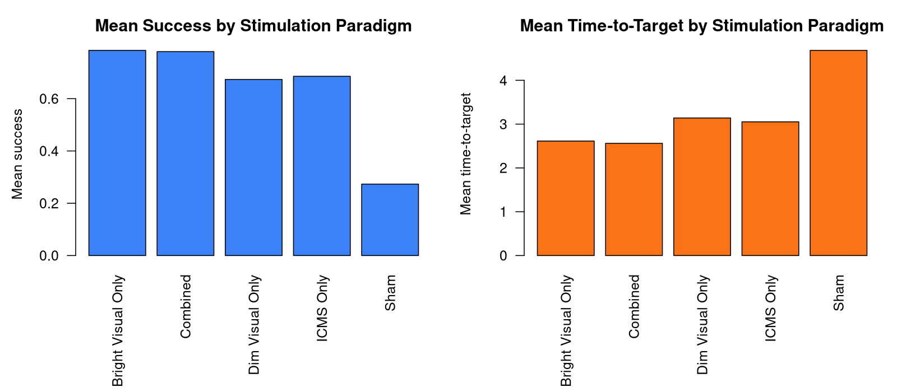
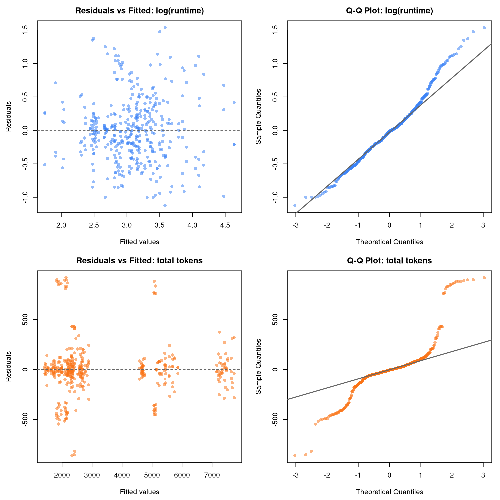
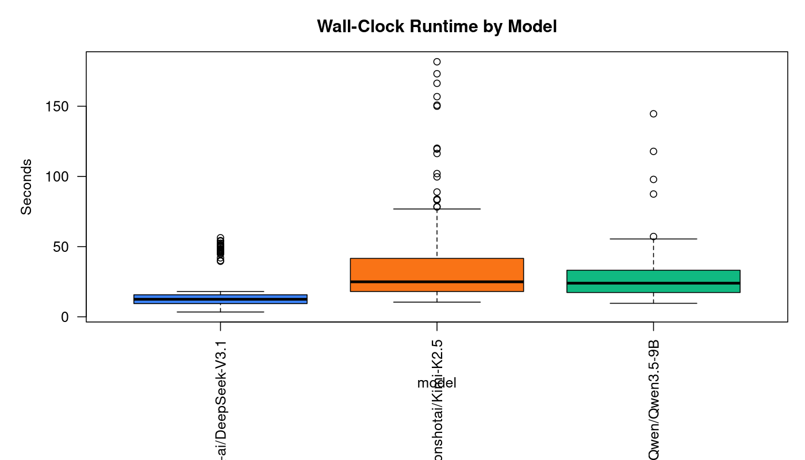
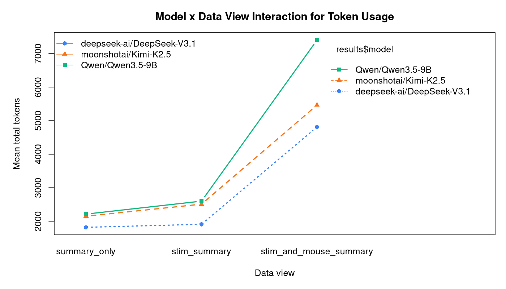
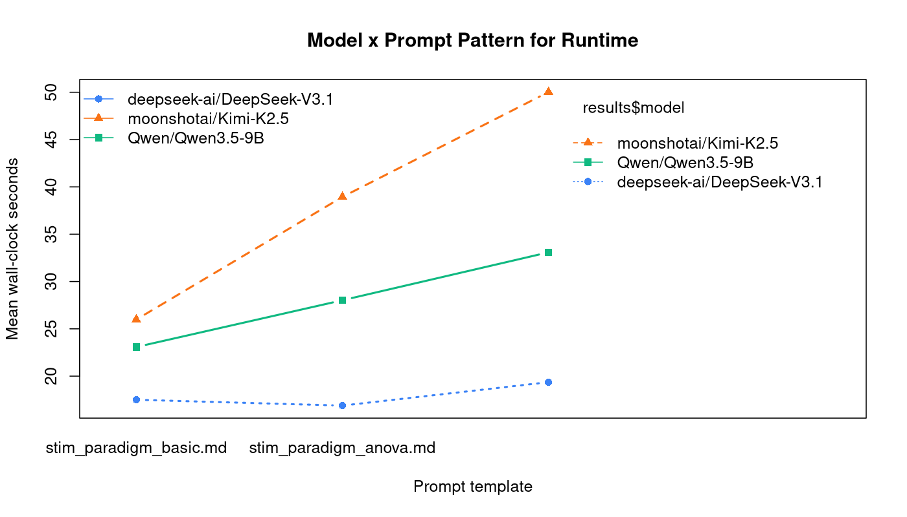
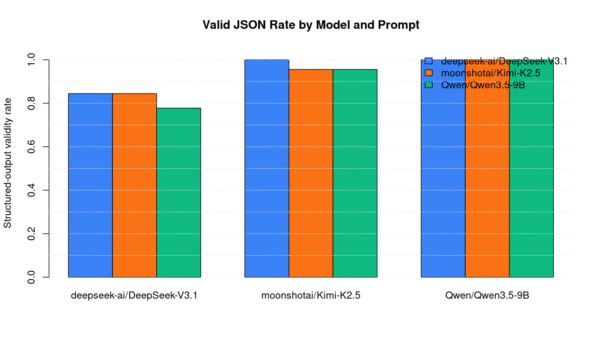

# A Full Factorial Study of LLM-Based Statistical Analysis for Mouse Navigation Data

**Draft manuscript for revision**

**Authors:** `[Add team members, majors, departments, and contribution statements here]`

## Abstract

This project studied how large language model (LLM) configuration choices affect the cost, latency, and structural reliability of automated statistical analyses. The motivating application was a mouse navigation dataset containing 78,687 original observations, of which 76,655 remained after filtering to five stimulation paradigms: Combined, ICMS Only, Dim Visual Only, Bright Visual Only, and Sham. Each LLM was asked to analyze performance using only five response variables: Time-to-Target, Success, Path Efficiency, Average Speed, and AD (angular dispersion). The experimental design was a completely randomized full factorial with four treatment factors: model (DeepSeek-V3.1, Kimi-K2.5, Qwen3.5-9B), temperature (0, 0.25, 0.5, 0.75, 1.0), prompt template (basic, ANOVA, predictive), and data view (summary_only, stim_summary, stim_and_mouse_summary). Three replications per treatment combination yielded 405 planned runs, all of which were completed successfully after rerunning initial API failures.

The final experiment consumed 1,389,891 total tokens and produced valid JSON in 377/405 runs (93.1%). Data view was the dominant determinant of token usage in the ANOVA for total tokens (F = 6311.74, p < 2.2e-227, eta-squared = 0.846), with a strong model-by-data-view interaction (F = 200.28, p < 1.7e-79). Runtime was driven primarily by model choice (F = 58.47, p < 8.1e-22, eta-squared = 0.212), with DeepSeek-V3.1 fastest on average (17.9 s), Kimi-K2.5 slowest (38.3 s), and Qwen3.5-9B intermediate (28.1 s). Qwen3.5-9B achieved 100% valid JSON, Kimi-K2.5 achieved 97.0%, and DeepSeek-V3.1 achieved 82.2%, with all invalid outputs attributable to max-token truncation. The observed Together AI spend for the project was approximately $1.11, which made three replications economically feasible. Overall, the study shows that prompt/data packaging and model selection matter far more than temperature for practical LLM analysis pipelines.

## 1. Introduction

Large language models are increasingly used as lightweight analysis assistants, but their behavior can vary materially with model family, prompt framing, and the amount of context supplied at inference time. For a Design of Experiments (DOE) project, this makes LLM pipelines a natural applied setting: the analyst can manipulate several controllable factors, randomize execution order, replicate treatment combinations, and study multiple response variables such as cost, speed, and output fidelity.

The scientific context for this project came from a mouse navigation dataset shared within the project team. The data describe navigation performance under five stimulation paradigms: Combined, ICMS Only, Dim Visual Only, Bright Visual Only, and Sham. The performance variables available to the models were Time-to-Target, Success, Path Efficiency, Average Speed, and AD (angular dispersion). Rather than writing the final biological interpretation ourselves, the LLMs were asked to generate structured statistical analyses of those data under increasingly specific prompting conditions.

The central research question for the DOE component was:

**How do model choice, temperature, prompt specificity, and data-view complexity affect the computational and structural performance of LLM-generated statistical analyses?**

An experimental design is appropriate here because the pipeline has clearly defined treatments, measurable outputs, and meaningful run-to-run variation from both stochastic text generation and cloud inference conditions. The design used in this study was a balanced, replicated, completely randomized full factorial design. This manuscript first describes the filtered mouse dataset and the LLM pipeline, then presents the design and statistical analysis, reports the main factorial results, and closes with practical interpretation and limitations.

## 2. Methods

### 2.1 Study context and underlying data

The input data were stored in `data.csv`. The original file contained 78,687 rows. For the LLM task, the dataset was filtered to the five stimulation paradigms required by the project scope, leaving 76,655 rows and 7 columns. No missing values remained in the filtered analytic dataset.

The retained columns were:

- `Mouse`
- `Stim Paradigm`
- `Time-to-Target`
- `Success`
- `Path Efficiency`
- `Average Speed`
- `AD`

The dataset contained 8 mice and 5 stimulation paradigms. The paradigm distribution was unbalanced, with Combined dominating the sample (48,846 rows), followed by ICMS Only (11,378), Dim Visual Only (9,603), Sham (3,505), and Bright Visual Only (3,323). This imbalance mattered because it shaped the summaries exposed to the models and likely influenced how easily each prompt could extract stable patterns.

Table 1 gives the coarse descriptive summary that motivated the analysis task presented to the LLMs.

**Table 1. Filtered source-data summary by stimulation paradigm**

| Stim paradigm | n | Mean success | Mean time-to-target | Mean path efficiency | Mean average speed | Mean AD |
|---|---:|---:|---:|---:|---:|---:|
| Bright Visual Only | 3,323 | 0.785 | 2.614 | 0.504 | 12.679 | 0.387 |
| Combined | 48,846 | 0.780 | 2.562 | 0.502 | 12.833 | 0.399 |
| Dim Visual Only | 9,603 | 0.673 | 3.140 | 0.434 | 11.968 | 0.336 |
| ICMS Only | 11,378 | 0.685 | 3.053 | 0.432 | 12.039 | 0.354 |
| Sham | 3,505 | 0.273 | 4.682 | 0.308 | 10.737 | 0.236 |

The descriptive pattern is strong even before any modeling. Combined and Bright Visual Only had the highest mean success rates and the fastest time-to-target, while Sham was substantially worse on both measures. Relative to Combined, Sham’s mean success was lower by 0.506 and its mean time-to-target was 1.83 times higher. This gave the LLMs a real statistical signal to detect, which was useful for stress-testing prompt structure and context packaging.

*Figure 1. The filtered mouse dataset already shows strong between-paradigm differences, especially in mean success and mean time-to-target. These summaries were deliberately exposed to the LLMs as the substance of the analysis task.*

### 2.2 Experimental units, treatments, and blocking

The experimental unit was **one LLM analysis run**. Each run consisted of:

1. a fixed system prompt,
2. one prompt template,
3. one selected data view,
4. one model,
5. one temperature setting,
6. a call to Together AI,
7. a saved prompt, saved JSON response, and recorded runtime/token metrics.

No blocking factor was used. All runs were executed through the same local pipeline and the same Together AI API backend. To reduce order effects, the treatment combinations were randomized before execution.

The treatment structure is summarized in Table 2.

**Table 2. Design factors and levels**

| Factor | Levels | Notes |
|---|---|---|
| Model | 3: DeepSeek-V3.1, Kimi-K2.5, Qwen3.5-9B | Together AI serverless models; reasoning disabled for comparability |
| Temperature | 5: 0.00, 0.25, 0.50, 0.75, 1.00 | Treated as a categorical factor |
| Prompt template | 3: basic, ANOVA, predictive | Increasing inferential specificity |
| Data view | 3: summary_only, stim_summary, stim_and_mouse_summary | Increasing data-context size |
| Replication | 3 repeated runs per cell | Full factorial CRD: 3 x 5 x 3 x 3 x 3 = 405 runs |

The three prompt templates were designed to vary only the inferential burden:

- `stim_paradigm_basic.md`: descriptive comparison only.
- `stim_paradigm_anova.md`: ANOVA and post-hoc planning.
- `stim_paradigm_predictive.md`: ANOVA, post-hoc analysis, multiplicity correction, and predictive-model recommendation.

The three data views were:

- `summary_only`: high-level dataset overview only.
- `stim_summary`: overview plus summary by stimulation paradigm.
- `stim_and_mouse_summary`: overview plus paradigm summary, mouse-by-paradigm summary, and sampled rows.

### 2.3 Randomization and replication plan

The design was generated programmatically from `configs/full_factorial.json` using random seed `51400`, with full randomization of execution order. The treatment space comprised 135 unique combinations, each replicated 3 times for a total of 405 runs.

Replication served two purposes. First, it captured stochastic variation from nonzero temperatures. Second, it measured operational variability arising from cloud inference, such as latency fluctuations and occasional service instability. Because the token cost was low, three replications were financially reasonable: using the reported total project spend of $1.11, the average cost per treatment combination was only about $0.00822, and the average cost per run was about $0.00274.

### 2.4 Execution and data collection

The core pipeline was implemented in Python 3.14.4. The project currently contains:

- 10 source modules under `src/`
- 1,472 Python source lines
- 193 Python test lines
- 1,665 total Python lines across source and tests

The direct Python runtime dependencies were pinned as:

- `python-dotenv==1.2.2`
- `together==2.12.0`

Together AI was used as the live inference backend. The exact serverless model strings were:

- `deepseek-ai/DeepSeek-V3.1`
- `moonshotai/Kimi-K2.5`
- `Qwen/Qwen3.5-9B`

Each run used Together AI structured-output mode with JSON response formatting. Reasoning was explicitly disabled for all three models to improve comparability. The maximum output budget was fixed at 1,800 tokens per run.

The pipeline recorded the following outputs for each run:

- wall-clock runtime in seconds,
- input token count,
- output token count,
- total token count,
- stop reason,
- exact prompt path,
- exact response path,
- JSON validity,
- schema-completeness score.

Initially, 7 runs failed because of service timeouts or a transient 503 error. Those failures were rerun separately, and the final dataset is complete with all 405 planned observations present. However, 28 completed API calls hit the `max_tokens` ceiling and returned truncated, invalid JSON. Those were not missing observations; rather, they are part of the substantive response surface because truncation itself is an operational outcome of interest.

## 3. Statistical Analysis

### 3.1 Model specification

Three outcomes were analyzed:

1. `total_token_count` as a cost proxy,
2. `wall_clock_seconds` as a latency proxy,
3. `response_json_valid` as a structural reliability proxy.

For the continuous outcomes, I fit full-factorial ANOVA models:

- `total_token_count ~ model * temperature * prompt * data_view`
- `log(wall_clock_seconds) ~ model * temperature * prompt * data_view`

Runtime was log-transformed because the raw runtime distribution was right-skewed and bounded below by zero. Given the fully balanced design, factorial ANOVA is appropriate for effect screening and provides interpretable sums of squares for main effects and interactions.

For the binary validity outcome, I fit an additive logistic regression:

- `logit(P(valid JSON)) ~ model + temperature + prompt + data_view`

I used the additive form because Qwen3.5-9B achieved perfect structured-output validity, which creates separation problems in richer logistic models.

### 3.2 Planned hypotheses and contrasts

The primary hypotheses were:

- **Model effect:** different LLMs differ in runtime, token usage, and structured reliability.
- **Prompt effect:** more inferentially demanding prompts increase cost and latency and may reduce structural reliability.
- **Data-view effect:** richer data packaging increases token usage and may affect runtime and validity.
- **Temperature effect:** higher temperatures may alter verbosity or increase malformed outputs.

For post-hoc interpretation, I used Tukey HSD contrasts on one-factor marginal summaries where they were substantively clear and not confounded by strong interaction patterns. In particular, I used:

- Tukey comparisons for model differences in log-runtime,
- Tukey comparisons for data-view differences in total token count.

All tests were interpreted as two-sided with alpha = 0.05.

### 3.3 Diagnostics

I inspected residual-vs-fitted and normal Q-Q plots for both ANOVA models. The log transformation materially improved runtime residual symmetry. The token model still showed some spread inflation at the largest fitted values, which is unsurprising because `stim_and_mouse_summary` creates a much larger context package than the other two views. The design is balanced and the main conclusions are large in magnitude, so these modest deviations are unlikely to reverse the substantive findings.

*Figure 2. Diagnostics for the log-runtime and total-token ANOVA models. The log transform improved runtime residual behavior; token residuals show mild remaining heteroskedasticity at large fitted values, but the dominant effects are large and stable.*

### 3.4 Sensitivity and robustness analysis

I examined a simple robustness check by recomputing mean runtime and token usage on the subset of runs with `done_reason = "stop"` only. The main ranking of models did not change:

- DeepSeek-V3.1 remained the fastest,
- Kimi-K2.5 remained the slowest,
- Qwen3.5-9B remained the most token-intensive.

This indicates that the overall ranking is not an artifact of a small number of capped runs, although the truncation issue does materially lower DeepSeek-V3.1’s structural reliability.

## 4. Results

### 4.1 Overall experiment completion and cost

The completed dataset contains all 405 planned runs. Of these, 377 produced valid JSON, yielding a structured-output validity rate of 93.1%. All 28 invalid outputs were associated with `done_reason = "length"`, meaning that malformed responses arose entirely from hitting the output cap rather than from spontaneous JSON-schema drift.

The experiment used:

- 953,145 input tokens,
- 436,746 output tokens,
- 1,389,891 total tokens.

The mean runtime per run was 28.10 seconds, and the sum of run-level wall-clock times was 11,379.44 seconds, or about 3 hours, 9 minutes, and 39 seconds of active model time. The reported Together AI spend for the project was approximately **$1.11**. Using Together’s listed serverless prices at the time of writing, the direct token cost for the final 405-run sweep is estimated at about **$1.05**, which is close to the observed spend and plausibly lower because the billed total also reflects smoke tests and rerun attempts not represented in the final balanced CSV.

This cost profile is important for the DOE interpretation. A one-replication version of the study would have cost only about one third as much, so the extra two replications were purchased for roughly $0.74. For a class project, that is an unusually cheap way to stabilize estimates and preserve a balanced design.

### 4.2 Descriptive model comparison

Table 3 summarizes the three models across the full 405-run experiment.

**Table 3. Mean computational performance by model**

| Model | Mean runtime (s) | Mean input tokens | Mean output tokens | Mean total tokens | Valid JSON rate | Length-cap rate |
|---|---:|---:|---:|---:|---:|---:|
| DeepSeek-V3.1 | 17.92 | 2,080.67 | 766.54 | 2,847.21 | 0.822 | 0.178 |
| Kimi-K2.5 | 38.31 | 2,045.67 | 1,329.17 | 3,374.84 | 0.970 | 0.030 |
| Qwen3.5-9B | 28.06 | 2,934.00 | 1,139.44 | 4,073.44 | 1.000 | 0.000 |

The pattern is clear:

- **DeepSeek-V3.1** was the fastest and cheapest in token terms, but it was also the least reliable structurally because it truncated far more often than the other two models.
- **Kimi-K2.5** was the slowest model by a large margin, but its structured-output reliability was very high.
- **Qwen3.5-9B** had the highest token usage but perfect JSON validity in the completed study.

The runtime ranking is visualized in Figure 3.

*Figure 3. DeepSeek-V3.1 was usually fastest, Kimi-K2.5 was clearly slowest, and Qwen3.5-9B was intermediate. The spread for Kimi-K2.5 was also the largest.*

### 4.3 ANOVA for token usage

The ANOVA for `total_token_count` showed that token usage was dominated by the amount of context passed to the model. The strongest effects were:

- **data_view:** F = 6311.74, p < 2.2e-227, eta-squared = 0.846
- **model:** F = 522.62, p < 1.5e-93, eta-squared = 0.070
- **model x data_view:** F = 200.28, p < 1.7e-79, eta-squared = 0.054
- **prompt:** F = 33.96, p < 7.0e-14, eta-squared = 0.0045

Temperature had no statistically meaningful main effect on token usage (F = 0.85, p = 0.493).

This means that token cost depended overwhelmingly on how much summarized data the model saw, and secondarily on which model tokenized that content. The model-by-data-view interaction was especially important. Average total tokens by model and data view were:

- DeepSeek-V3.1: 1,819 (`summary_only`), 1,909 (`stim_summary`), 4,813 (`stim_and_mouse_summary`)
- Kimi-K2.5: 2,149, 2,510, 5,465
- Qwen3.5-9B: 2,214, 2,601, 7,406

Thus, Qwen3.5-9B paid a much larger token penalty than the other models when the richest data view was used. This is visible in Figure 4.

*Figure 4. The richest data view sharply increased token usage for all models, but especially for Qwen3.5-9B. This interaction is one of the central findings of the experiment.*

Tukey contrasts on the marginal data-view effect confirmed that all pairwise differences were statistically significant:

- `stim_and_mouse_summary` used 3,555 more tokens than `stim_summary` on average (p < 0.001),
- `stim_and_mouse_summary` used 3,834 more tokens than `summary_only` on average (p < 0.001),
- `stim_summary` still used 279 more tokens than `summary_only` on average (p = 0.0066).

### 4.4 ANOVA for runtime

The ANOVA for log-runtime showed that **model** was the dominant runtime factor:

- **model:** F = 58.47, p < 8.1e-22, eta-squared = 0.212
- **prompt:** F = 7.06, p = 0.0010, eta-squared = 0.0256
- **temperature x prompt:** F = 2.23, p = 0.0257, eta-squared = 0.0324
- **model x temperature x data_view:** F = 2.44, p = 0.0018, eta-squared = 0.0709

The main effect of data view on runtime was not significant after accounting for interactions (F = 0.50, p = 0.607), which is interesting because data view completely dominated token usage. In practical terms, sending more context absolutely increased token counts, but the cloud-service latency picture was more complicated and model-specific.

Prompt means were still directionally intuitive:

- `basic`: 22.19 s mean runtime
- `anova`: 27.95 s
- `predictive`: 34.16 s

So more inferentially demanding prompts were slower on average, especially the predictive prompt.

Tukey contrasts on log-runtime by model showed that all three pairwise differences were statistically significant:

- Kimi-K2.5 was slower than DeepSeek-V3.1 (difference = 0.737 on the log scale, p < 0.001),
- Qwen3.5-9B was slower than DeepSeek-V3.1 (difference = 0.555, p < 0.001),
- Kimi-K2.5 was also slower than Qwen3.5-9B (difference = 0.182, p = 0.037).

Figure 5 shows the model-by-prompt runtime pattern.

*Figure 5. Runtime increased with prompt complexity, but the size of that increase depended on the model. Kimi-K2.5 was consistently the slowest option.*

### 4.5 Structured-output validity

Structured-output validity was intentionally defined narrowly: the response had to be valid JSON that matched the required top-level schema. By that criterion, the overall validity rate was 93.1%.

The additive logistic model showed that **model** was the only clearly important predictor of structured-output validity:

- Likelihood-ratio test for model: chi-squared = 41.80, p = 8.38e-10
- Temperature: p = 0.625
- Prompt: p = 0.441
- Data view: p = 0.441

Descriptively:

- Qwen3.5-9B: 100.0% valid JSON
- Kimi-K2.5: 97.0%
- DeepSeek-V3.1: 82.2%

Figure 6 shows validity rates by model and prompt. DeepSeek-V3.1 had the only notable fragility, especially on more demanding prompt/data combinations. Qwen3.5-9B produced valid JSON for every run in the final study.

*Figure 6. Structural reliability was primarily a model effect. Qwen3.5-9B was perfect in this study, Kimi-K2.5 was nearly perfect, and DeepSeek-V3.1 was much more vulnerable to length-capped outputs.*

## 5. Discussion

This experiment produced three main conclusions.

First, **data packaging is the dominant cost lever**. The shift from `summary_only` to `stim_and_mouse_summary` massively increased total tokens for every model. This means that prompt engineering alone is not the main cost control in LLM analytics pipelines; artifact design and context compression are at least as important.

Second, **model choice creates a clear tradeoff among speed, reliability, and token use**. DeepSeek-V3.1 was attractive when low latency mattered, but it was the least reliable under the fixed 1,800-token cap. Qwen3.5-9B was the most stable and always returned valid JSON, but it paid a token premium, especially for the richest context view. Kimi-K2.5 delivered high validity but at a substantial runtime cost.

Third, **temperature mattered less than expected**. Across both runtime and token usage, temperature had no important main effect. This suggests that future resource-constrained replications of the study could probably reduce the number of temperature levels without losing much practical information.

The project also says something positive about experimental efficiency. The full, replicated design was inexpensive. A reported spend of $1.11 for 405 runs is extremely modest, especially given the richness of the logged outputs and the fact that the design remained fully balanced after rerunning failed jobs. In that sense, the DOE succeeded not only statistically but operationally: it was cheap enough to replicate properly.

Several limitations remain. Most importantly, this study measured **computational and structural performance**, not the truthfulness or scientific correctness of each model’s statistical reasoning. Valid JSON is not the same as valid inference. A stronger follow-up study would add a human or rules-based rubric for statistical correctness, use ground-truth benchmark answers, and rate whether each LLM drew the right conclusion about the stimulation paradigms. Another limitation is that token usage is partly a tokenizer artifact, so “cost” and “verbosity” are not perfectly separable. Finally, Together AI latency reflects real serverless conditions at the time of execution, so the runtime findings are useful but not hardware-invariant.

Future improvements are straightforward:

- adapt `max_tokens` by prompt complexity or data view,
- add a formal accuracy rubric for the statistical content,
- reduce temperature levels if budget is tight,
- consider blocking by execution batch or time-of-day,
- test compressed data summaries to reduce token cost without sacrificing validity.

## 6. References

Box, G. E. P., Hunter, J. S., & Hunter, W. G. (2005). *Statistics for Experimenters: Design, Innovation, and Discovery* (2nd ed.). Wiley.

Montgomery, D. C. (2019). *Design and Analysis of Experiments* (10th ed.). Wiley.

Python Software Foundation. (2026). *Python 3.14.4 documentation*. https://docs.python.org/3/

Together AI. (2026). *Chat*. https://docs.together.ai/docs/chat-overview

Together AI. (2026). *Structured Outputs*. https://docs.together.ai/docs/json-mode

Together AI. (2026). *Serverless Models*. https://docs.together.ai/docs/serverless-models

Together AI. (2026). *DeepSeek V3.1 quickstart*. https://docs.together.ai/docs/deepseek-3-1-quickstart

R Core Team. (2026). *R: A Language and Environment for Statistical Computing*. R Foundation for Statistical Computing, Vienna, Austria.

## Appendix A. Reproducibility Notes

The following project files are especially relevant if this draft is converted into the final manuscript appendix:

- `configs/full_factorial.json`: final design specification.
- `outputs/results.csv`: run-level results (405 rows).
- `outputs/results_summary.csv`: treatment-level summary (135 rows).
- `outputs/prompts/`: rendered prompts by run.
- `outputs/responses/`: saved JSON responses by run.
- `analysis/generate_report_artifacts.R`: figure/table regeneration for this draft.
- `report/tables/`: CSV tables used in this draft.
- `report/assets/`: figures used in this draft.

## Appendix B. Suggested edits before submission

- Add the final author list and contribution statement.
- Replace “Draft manuscript” text with a final title page.
- Decide whether to keep both the reported Together spend ($1.11) and the price-table estimate ($1.05), or to report only one with a short explanation.
- If space is limited, move Figure 2 diagnostics and some ANOVA tables to the appendix.
- If the instructor expects more direct statistical analysis of the **mouse** dataset itself, add one short appendix section with one-way ANOVAs for each biological response variable across stimulation paradigms.
